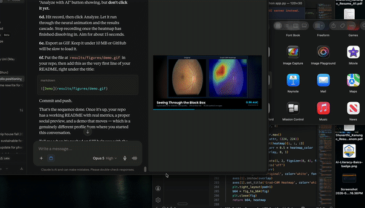

# Seeing Through the Black Box

### Explainable AI for Diabetic Retinopathy Detection

**0.96 AUC on proliferative diabetic retinopathy, and four ways to see why.**



An EfficientNet-B4 classifier grades diabetic retinopathy severity across five
clinical stages, trained on 35,126 retinal fundus photographs from EyePACS. Every
prediction is paired with four independent explainability methods: Grad-CAM,
Integrated Gradients, Feature Map Attention, and SHAP.

**Macro AUROC 0.7905** on a fully held-out 5,269-image test set, with the
strongest performance on the grades that matter most clinically.

**[Model weights](https://huggingface.co/Shuverthi/efficientnet-b4-diabetic-retinopathy)**

---

## Why this project

Diabetic retinopathy is a leading cause of preventable blindness. Screening
depends on ophthalmologists manually examining retinal photographs, which is slow,
costly, and unavailable across much of the world. Automated grading could close
that gap.

The obstacle is trust. Deep networks in healthcare behave as black boxes: they
return a grade with no account of their reasoning, and clinicians are reasonably
unwilling to act on that. This project pairs detection with four explainability
methods so every prediction can be inspected, and so a clinician can check whether
the model attended to actual pathology or to an imaging artifact.

## Results

### Held-out test set (5,269 images)

| Metric | Value |
|---|---|
| Macro AUROC (one-vs-rest) | **0.7905** |
| Quadratic weighted kappa | 0.5312 |
| Accuracy | 60.37% |

**Why accuracy is the least useful number here.** Grade 0 makes up 73.5% of the
dataset, so a model predicting "No DR" for every image would score 73.5% accuracy
while being clinically worthless. AUROC measures separability independent of class
frequency, and quadratic weighted kappa respects the ordinal structure of DR
grading, where confusing grade 3 with grade 4 is a smaller error than confusing
grade 0 with grade 4. QWK is also the official metric of the original EyePACS
Kaggle competition, which makes 0.5312 directly comparable to published work.

### Per-grade AUC

| Grade | Clinical stage | AUC | Recall |
|---|---|---|---|
| 0 | No DR | 0.777 | 69.3% |
| 1 | Mild DR | 0.605 | 25.4% |
| 2 | Moderate DR | 0.700 | 34.5% |
| 3 | Severe DR | **0.912** | 46.6% |
| 4 | Proliferative DR | **0.959** | 65.1% |

**Performance rises with clinical urgency.** The model is strongest exactly where
a missed case does the most damage: 0.959 AUC on proliferative DR and 0.912 on
severe DR. Grade 1 is weakest at 0.605, which is the expected result. Mild DR is
defined by microaneurysms a few pixels across, and trained clinicians disagree on
the No-DR/Mild-DR boundary often enough that the label itself is noisy there.

### Generalization check

| Split | Loss | Accuracy | AUROC |
|---|---|---|---|
| Train (5,000-image sample) | 0.8274 | 68.04% | 0.8742 |
| Validation (5,269) | 1.0023 | 59.20% | 0.7684 |
| Test (5,269) | 0.9734 | 60.37% | 0.7905 |

The train-to-test AUROC gap is 0.0837, indicating mild overfitting. More
informative is that validation (0.7684) and test (0.7905) sit close together,
which is what confirms the model generalizes rather than having been tuned into
the validation split. Validation loss began rising after epoch 3; the checkpoint
was taken at epoch 6, before overfitting became material.

## Dataset

**EyePACS.** 35,126 retinal fundus photographs, clinically graded 0 to 4, captured
across varied cameras and clinical settings. That variability is useful: it
approximates real deployment conditions rather than a single-centre ideal.

| Grade | Stage | Count | Share |
|---|---|---|---|
| 0 | No DR | 25,810 | 73.5% |
| 1 | Mild DR | 2,443 | 7.0% |
| 2 | Moderate DR | 5,292 | 15.1% |
| 3 | Severe DR | 873 | 2.5% |
| 4 | Proliferative DR | 708 | 2.0% |
| | **Total** | **35,126** | |

The imbalance mirrors real screening populations, where most patients are healthy.
It also means a naive model can post high accuracy while detecting nothing, which
is why the loss is weighted by inverse class frequency.

Stratified split preserving class proportions: 24,588 train (70%), 5,269
validation (15%), 5,269 test (15%). The test set was never touched during training
or model selection. Fixed seed throughout.

## Approach

**Architecture.** EfficientNet-B4 via `timm`, ImageNet-pretrained, original head
removed and replaced with dropout (p=0.3) into a linear layer mapping 1,792
features to 5 classes. The full network was fine-tuned rather than frozen.

**Preprocessing.** Resize to 224×224, ImageNet mean/std normalization. All 35,126
images were preloaded into RAM as a single ~5.29GB NumPy array, which removed JPEG
decoding from the training loop and cut epoch time substantially.

**Augmentation** (training split only): random horizontal and vertical flips,
colour jitter on brightness and contrast within ±0.2.

**Training.** 10 epochs on a single NVIDIA T4 (Kaggle), Adam at lr 1e-4,
CosineAnnealingLR schedule, mixed-precision (AMP), cross-entropy weighted by
inverse class frequency. Checkpoint saved on best validation AUROC; epoch 6
selected.

## Explainability

Four methods, each applied to both correct and incorrect test-set predictions,
because the failures are where explanations earn their keep.

**Grad-CAM.** Gradients of the predicted class score with respect to the final
convolutional block, producing a spatial attention heatmap. Attention concentrated
on the central retina (optic disc and macula), where DR pathology appears. The
maps are coarse by construction: EfficientNet-B4's final block emits 7×7 feature
maps upsampled to 224×224, so gradients arrive stretched. That is a structural
limitation of Grad-CAM on this architecture, not an implementation artifact.

**Integrated Gradients.** Pixel-level attribution over 30 steps from a black
baseline. On correct predictions, attribution concentrated on blood vessels, the
optic disc, and visible lesions or haemorrhages. On misclassifications,
attribution frequently landed in the black background *outside* the retina, which
points at image border artifacts as a concrete failure mode.

**Feature Map Attention.** Top 8 most-activated channels from the final block. On
a correctly classified moderate case, different channels fired at different
retinal locations, indicating evidence gathered from multiple anatomical
structures. On a misclassified case, a single channel showed unusually high
activation spread diffusely across the frame.

**SHAP (GradientExplainer).** Shapley-value attribution against a 20-image
background reference. No single pixel dominated any explanation; importance was
distributed across the retinal surface with modest clustering near the optic disc
and along vessels. For a medical imaging model this is the desirable outcome, since
it suggests integration across the retina rather than reliance on one shortcut
feature.

**The most actionable finding across all four methods:** on misclassified images,
attribution repeatedly fell outside the retina, on the black border. That points
directly at a preprocessing fix (crop and centre the retinal disc before training)
rather than a modelling change, which is exactly the kind of insight that
justifies building an explainability layer in the first place.

## Demo

Flask application accepting a retinal image and returning the predicted grade,
class probabilities, and all four attribution maps. When an uploaded filename
matches a labelled image, the true grade is shown beside the prediction so correct
and incorrect cases can be compared directly.

```bash
python app.py     # http://localhost:5050
```

## Setup

```bash
git clone https://github.com/shuvgits/Seeing-Through-the-Black-Box-Explainable-AI-for-Diabetic-Retinopathy-Detection.git
cd Seeing-Through-the-Black-Box-Explainable-AI-for-Diabetic-Retinopathy-Detection

python -m venv venv
source venv/bin/activate          # Windows: venv\Scripts\activate
pip install -r requirements.txt
```

Download the checkpoint from
[Hugging Face](https://huggingface.co/Shuverthi/efficientnet-b4-diabetic-retinopathy)
into `models/checkpoints/`.

EyePACS data: https://www.kaggle.com/c/diabetic-retinopathy-detection

## Repository structure

```
├── app.py                                      Flask demo, four XAI methods
├── src/
│   ├── model.py                                EfficientNet-B4 classifier (timm)
│   ├── dataset.py                              PyTorch Dataset
│   ├── preprocessing.py                        load, crop, resize, normalize, augment
│   └── train_efficientnet.py                   local training script
├── notebooks/
│   ├── 01_Data_Exploration.ipynb
│   ├── 02_Data_Preprocessing.ipynb
│   └── 03_Kaggle_EfficientNet_Training.ipynb   run that produced the checkpoint
├── templates/index.html
└── results/
    ├── figures/                                ROC curves, confusion matrices, loss curves
    └── metrics/
```

## Limitations

- **224×224 loses fine detail.** Microaneurysms, the defining lesion of grade 1,
  measure a few pixels at native resolution. Downsampling to 224 plausibly explains
  much of the 0.605 AUC on mild DR.
- **Grades 1 and 2 are not clinically usable** at 0.605 and 0.700 AUC. The model is
  a credible triage aid for severe and proliferative disease; it is not a screening
  tool for early DR.
- **Black borders confuse the model.** The XAI analysis shows attribution landing
  outside the retina on failures. Retinal disc cropping was not applied.
- **Grad-CAM resolution is structurally coarse** here (7×7 upsampled to 224×224).
  Fine localization claims should not rest on Grad-CAM for this architecture.
- **Attribution maps are not lesion localization.** They have not been validated
  against pixel-level clinical annotation. A highlighted region indicates output
  sensitivity, not confirmed pathology.
- **Single dataset, single architecture.** No external validation; every result is
  conditional on EyePACS and EfficientNet-B4.
- **Label noise at the No-DR/Mild boundary** is a known property of EyePACS, so the
  grade 1 ceiling is partly a data problem rather than a model problem.

## What I would do next

- **Retrain at 512×512.** The most likely single source of gain, given that the
  weakest grades are the ones defined by the smallest lesions.
- **Crop and centre the retinal disc** before training, directly targeting the
  border-artifact failure mode the XAI analysis surfaced.
- **External validation on IDRiD**, which ships pixel-level lesion ground truth for
  microaneurysms, haemorrhages, and exudates. This would let the attribution maps
  be scored against real pathology rather than assessed qualitatively.
- **Quantify agreement between the four methods** and test whether disagreement is
  higher on misclassifications. If so, inter-method disagreement becomes a usable
  confidence signal.
- **Moderate oversampling of minority grades**, plus learning-rate warmup and
  longer training.
- **Clinician user study** on whether the heatmaps align with expert diagnostic
  attention, which is the real test of whether any of this earns trust.

## Disclaimer

Research and educational use only. Not a medical device. No clinical validation, no
regulatory clearance. Must not be used for diagnosis, screening, or treatment
decisions.

## References

EfficientNet (Tan & Le, ICML 2019) · Grad-CAM (Selvaraju et al., ICCV 2017) ·
Integrated Gradients (Sundararajan et al., ICML 2017) · SHAP (Lundberg & Lee,
NeurIPS 2017) · EyePACS via the Kaggle Diabetic Retinopathy Detection competition
(2015).

## License

MIT (code). Dataset subject to its original terms.
